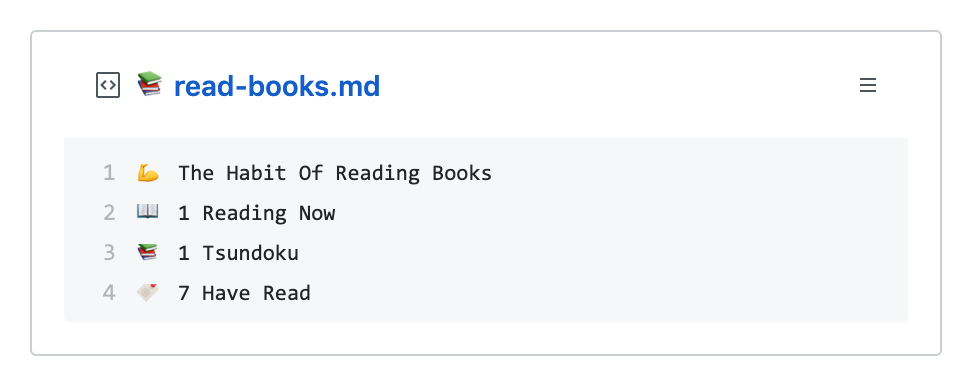

  
  <h3 align="center">book-box</h3>
  
🔖Do you reading books recently? 
  📚Update a pinned gist to contain the status of reading books from Google Books.

---

> 📌✨ For more pinned-gist projects like this one, check out: https://github.com/matchai/awesome-pinned-gists

## Setup
**book-box** is a GitHub Action that is designed to work using the [`schedule`](https://developer.github.com/actions/managing-workflows/creating-and-cancelling-a-workflow/#scheduling-a-workflow) event.

### Prepare work
1. Create a new public GitHub Gist (https://gist.github.com/)
1. Create a token with the `gist` scope and copy it. (https://github.com/settings/tokens/new)
1. Login with the Google Books (https://books.google.co.jp/books)
1. In my library page, retrieve the user ID which contains `uid` URL parameter:
`https://books.google.com/books?`**`uid=11122233344455566778`**`&source=gbs_lp_bookshelf_list`

### Project setup
1. Fork this repo
1. Edit the [environment variable](https://github.com/kentaro-m/book-box/blob/master/.github/workflows/schedule.yml#L13-L15) in `.github/workflows/schedule.yml`:

   - **GIST_ID:** The ID portion from your gist url: `https://gist.github.com/kentaro-m/`**`7943c292ae2caec7b4198319d1446b90`**.

1. Go to the repo **Settings > Secrets**
1. Add the following environment variables:
   - **GH_TOKEN:** The GitHub token generated above.
   - **USER_ID:** The user ID for your Google Books account.

## Licence
MIT